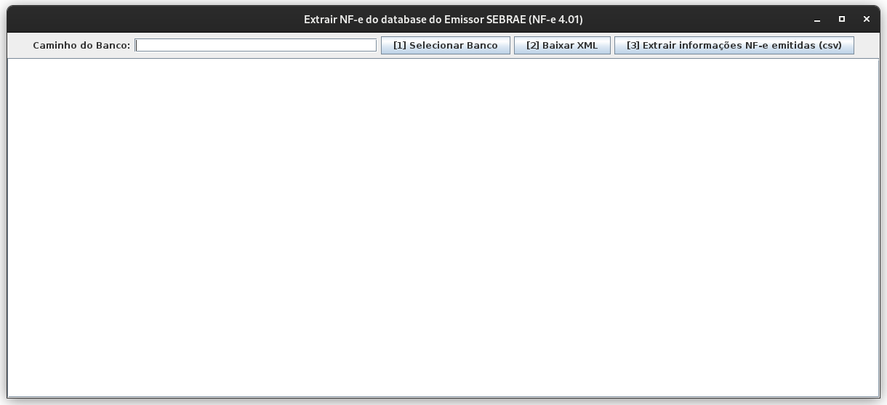

# Emissor NF-e SEBRAE Extrator



### Extrair NF-e do database do Emissor SEBRAE (NF-e 4.01)
Software para extrair os XML que estão na pasta database do antigo sistema de emissão de NF-e do SEBRAE (NF-e 4.01).
Para utiliza-lo, basta extrair esta pasta para seu computador, compilar a classe **ExtractNfeZipGUI.java** e executar o programa.
É necessário o Java 17 ou superior instalado.
Na tela inicial, clique o botão [1] e informe o caminho da pasta database/NFE_400. Depois clique no botão [2] para extrair os arquivos.


### Pre-requisitos

```
-> Java 17 ou superior (testado apenas com o openjdk-17 no Linux Debian 12)
```


### Detalhes técnicos
O banco de dados utilizado pelo Emissor do SEBRAE é o *Apache Derby Embedded*.
O nome do banco é **NFE** e a tabela onde estão as NF-e chama-se **NOTA_FISCAL**.
A consulta ao banco de dados é realizada utilizando **jdbc + derby.jar**.
String SQL utilizada na consulta: `SELECT DOCUMENTO_DEST, DOC_XML FROM NFE.NOTA_FISCAL`
Desta forma, todos os registros do banco são retornados.
Os XMLs que estão no banco de dados estão zipados e são são salvos no diretório ./NF_ZIP.
Os arquivos zip são salvos, um a um, com o seguinte nome: [numeroSequencial_DOCUMENTO_DEST.zip]
Ex:. `1_22222222222.zip, 2_33333333333.zip, ..., 125_22222222222.zip`
No qual o *DOCUMENTO_DEST* é o **CPF** ou **CNPJ** do destinatário da NF-e.


---

```
@dnat
```

